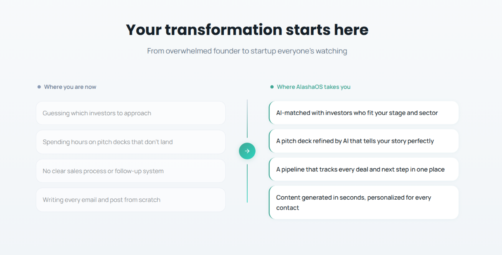
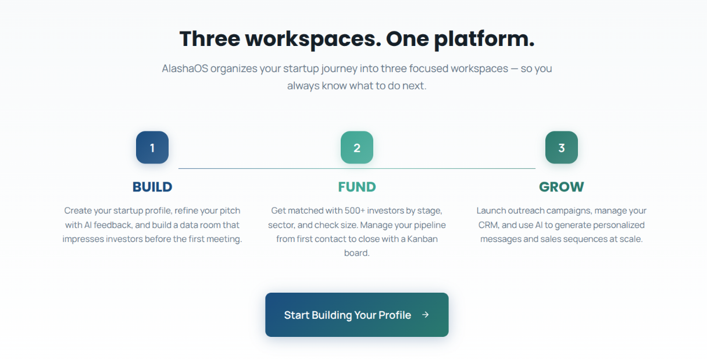

# 🧠 Growth Design Architect

<p align="left">
  <a href="https://skills.sh/woakin/growth-design-review"></a>
  
  <a href="./LICENSE"></a>
</p>

Turn your AI coding assistant into a **Senior Growth & Conversion Designer**. This skill audits UI designs, components, and frontend code against proven **Product Psychology**, **Behavioral Economics**, and **Conversion Rate Optimization (CRO)** frameworks to systematically eliminate friction and maximize conversion.

---

### ⚡ Install in 5 Seconds

Run this in your terminal to install the skill globally for all compatible AI editors (**Cursor, Windsurf, Claude Code, GitHub Copilot, Antigravity**):

```bash
npx skills add woakin/growth-design-review
```

---

## ⏱️ 30-Second Quick Start

Once installed, simply tag your component in your AI editor's chat:

```text
Review @src/components/PricingTable.tsx with growth-design-review:
- Goal: Upgrade free users to the Annual Pro plan.
- Target Audience: B2B team leads and engineering managers.
```

Your AI assistant will execute an objective audit and deliver an immediate **Prioritized Development Plan** (with code edits ready to apply).

---

## 🎨 Real-World Example: Before & After

*How the skill transforms a generic, low-converting landing page into a high-converting experience:*

<table align="center" width="100%">
  <tr>
    <td align="center" width="50%"><b>❌ Before Growth Design Review</b></td>
    <td align="center" width="50%"><b>✅ After Growth Design Review</b></td>
  </tr>
  <tr>
    <td align="center"></td>
    <td align="center"></td>
  </tr>
  <tr>
    <td>
      <ul>
        <li><b>Skittles Effect:</b> Multiple competing primary buttons.</li>
        <li><b>Generic copy:</b> Focuses on features instead of outcomes.</li>
        <li><b>High cognitive friction:</b> No clear visual anchor.</li>
      </ul>
    </td>
    <td>
      <ul>
        <li><b>Singular CTA:</b> High-contrast, prominent primary button.</li>
        <li><b>Benefit-driven copy:</b> Communicates value in 3 seconds.</li>
        <li><b>Immediate Social Proof:</b> Trusted logos and ratings above the fold.</li>
      </ul>
    </td>
  </tr>
</table>

---

## 🔄 The Causal Diagnostic Pipeline

Most UI reviews are subjective opinions. This skill makes them objective by running your interface through an end-to-end **Causal Diagnostic Pipeline** inspired by [Growth.design](https://growth.design/):

```
[1. Psych Framework] ──> [2. B.I.A.S. Audit] ──> [3. C.L.E.A.R. & Rules] ──> [4. Psych Triggers] ──> [5. Development Plan]
  Detects where user       Pinpoints the exact     Identifies the tangible UI/code       Prescribes the proven         Translates into concrete,
  energy depletes.         cognitive phase of      elements responsible for the break.   behavioral antidote for       actionable code edits
                           breakdown (B,I,A,S).                                          that specific friction.       prioritized by ROI.
```

### The 5 Diagnostic Layers

1. **Psych Framework** (`reference/psych.md`) — Calculates cognitive fuel ($P = \text{Motivation} \times \text{Ability}$), minimizes "Psych subtractions" (clutter, jargon), and applies the *Labor Illusion*.
2. **B.I.A.S. Behavioral Audit** (`reference/bias.md`) — Evaluates the 4-stage mental processing funnel: **Block** (trust & hierarchy), **Interpret** (clarity over cleverness), **Act** (decision simplicity), and **Store** (peak-end rule).
3. **C.L.E.A.R. Scorecard** (`reference/clear.md`) — A quantitative 1–5 scoring system across **C**opywriting, **L**ayout, **E**mphasis, **A**ccessibility, and **R**eward (up to 25 pts).
4. **UI Rules of Thumb** (`reference/rules-of-thumb.md`) — Context heuristics tailored for:
   - **Landing Pages:** Singular conversion focus, credibility signals, early social proof.
   - **E-commerce & PDP:** Sticky Add-to-Cart bar, adjacent friction reducers, variant clarity.
   - **Cart & Checkout:** Distraction-free flow, 1-click express checkout (Shop Pay, Apple Pay).
   - **Pricing Tables:** Visual anchoring, default annual savings callouts.
   - **Onboarding & Dashboards:** Time-to-Value (TTV), North Star metric hierarchy.
   - **Mobile-First:** Thumb Zone ergonomics, minimum 44x44px touch targets.
5. **Psychological Triggers** (`reference/psychological-triggers.md`) — 8 applied cognitive biases: *IKEA Effect, Zeigarnik Effect, Endowed Progress, Social Proof, Decoy Effect, Loss Aversion, Authentic Urgency, and Default Effect*.

---

## 🎯 How to Get 10/10 Results (Context Best Practices)

While the agent can audit any code automatically, providing **three quick context signals** unlocks surgical accuracy:

```text
Review @src/components/CheckoutModal.tsx using growth-design-review:
- Primary Goal: Complete order with 1-click payment.
- Target Audience: Mobile impulse shoppers (D2C E-commerce).
- Known Issue: 30% drop-off at the shipping information step.
```

1. **Tag the File(s):** Use `@ComponentName.tsx` so the agent evaluates actual markup, Tailwind classes, and state transitions.
2. **Define the Primary Goal:** Clarifies the exact action the visual hierarchy should drive.
3. **Specify the Audience (ICP):** D2C impulse buyers have very different friction tolerances than B2B enterprise buyers.

---

## 📋 Example Audit Output

```markdown
### 3. C.L.E.A.R. Scorecard
| Dimension | Score (1-5) | Finding & UI Driver |
| :--- | :---: | :--- |
| **C** - Copywriting | 2/5 | Headlines list technical features rather than user outcomes. |
| **L** - Layout | 4/5 | Strong Z-pattern visual hierarchy on desktop. |
| **E** - Emphasis | 2/5 | "Skittles Effect" detected—three competing primary buttons. |
| **A** - Accessibility | 3/5 | Low contrast ratio on secondary description copy (under 4.5:1). |
| **R** - Reward | 2/5 | Lack of instant micro-feedback on form submission. |
| **Total Score** | **13/25** | |

## 🏗 Prioritized Development Plan
### 🔴 Priority 1 — Critical (High Impact, Low Effort)
| # | Action | Root Cause & Antidote | Target File(s) | Expected Impact |
|---|--------|-----------------------|----------------|-----------------|
| 1 | Demote secondary buttons to ghost/outline style | Emphasis / Hick's Law | `Hero.tsx#L42` | Eliminates choice paralysis |
| 2 | Rewrite H1 headline to focus on 10x speed benefit | Copywriting / Clarity | `Hero.tsx#L18` | Increases 3-second comprehension |
```

---

## 📂 Repository Structure

```text
├── SKILL.md                  # The core AI instruction set & orchestrator
├── README.md                 # Project documentation & usage guide
├── LICENSE                   # MIT License
├── CONTRIBUTING.md           # Contribution guidelines
├── assets/                   # Images and media for documentation
└── reference/
    ├── psych.md              # Motivation x Ability framework & Labor Illusion
    ├── bias.md               # Behavioral audit (Block, Interpret, Act, Store)
    ├── clear.md              # Quantitative C.L.E.A.R. scoring guidelines
    ├── rules-of-thumb.md     # Heuristics: Landing, E-com, Checkout, Pricing, Onboarding, Mobile
    └── psychological-triggers.md # 8 Applied behavioral economics triggers
```

---

## ⚡ Ready to Supercharge Your Conversions?

Install the skill in your AI assistant now:

```bash
npx skills add woakin/growth-design-review
```

---

## 🤝 Contributing

Contributions are welcome! If you have a new Psychological Trigger or a UI Rule of Thumb to add:

1. Fork the repo.
2. Update the appropriate file in the `reference/` directory (e.g., `reference/rules-of-thumb.md`).
3. Open a Pull Request.

See [`CONTRIBUTING.md`](./CONTRIBUTING.md) for more details.

---

## ⚖️ License

Distributed under the MIT License. See [`LICENSE`](./LICENSE) for more information.

> *Disclaimer: This project is an independent implementation of growth principles and is not officially affiliated with Growth.design.*
